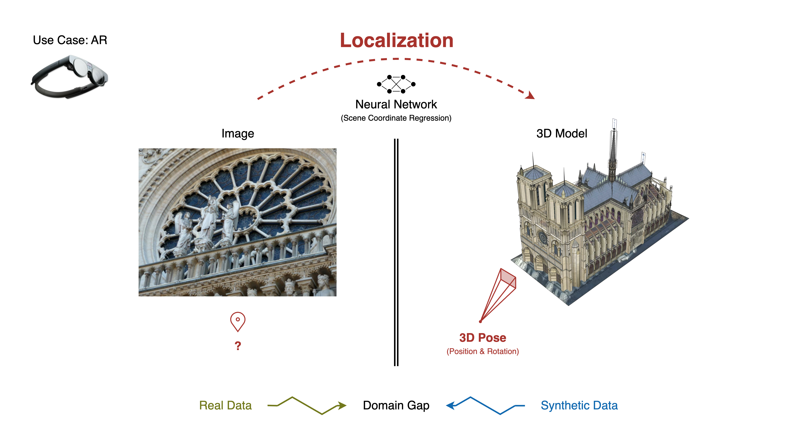

# Master's Thesis: Visual Localization against Universal 3D Models

[📄 Report](Report.pdf) | [📊 Presentation](Presentation.pdf)

Exploration of using CAD models as training data for visual localization, to localize real-world images of the same environment, avoiding the need for extensive real-world image collection.
Focus on (1) synthetic data generation from CAD models and (2) adapting Scene Coordinate Regression (neural-network-based visual localization) for efficiency and compatibility via supervised training and transfer learning.

See separate repositories for code and documentation:

1. [3D-Localization: Data Generation from 3D Models for Visual Localization](https://github.com/erictubo/3d-localization)
2. [GLACE-3D: Scene Coordinate Regression using 3D Models](https://github.com/erictubo/glace-3d)

## Abstract

Visual localization is essential for AR applications, enabling accurate placement of virtual content and collaborative experiences. State-of-the-art solutions rely on environment maps for stable and precise localization. While mapping small-scale spaces like rooms is relatively simple, the task becomes time-consuming in larger environments like warehouses or construction sites. However, existing 3D models of these environments, such as CAD models or LiDAR scans, offer a solution. Making use of these models has the potential to improve the AR experience and open up new applications.

Current visual localization methods primarily focus on real-world data or train and test on the same data type. However, localizing real-world images using synthetic data for training presents a significant challenge due to the domain gap between synthetic and real data, which has not been adequately addressed in existing solutions.

This project investigates adapting Scene Coordinate Regression for visual localization using CAD models, an area with limited prior research. We assess the compatibility of current visual localization methods with different types of 3D models, analyze their limitations, and explore strategies to enhance their performance. Our approach includes developing a synthetic data generation pipeline, implementing supervised training using scene coordinates as privileged information, and exploring transfer learning for domain adaptation to bridge the synthetic-real domain gap.

[...]

See [Report](./Report.pdf) or [Presentation](./Presentation.pdf) for more details.